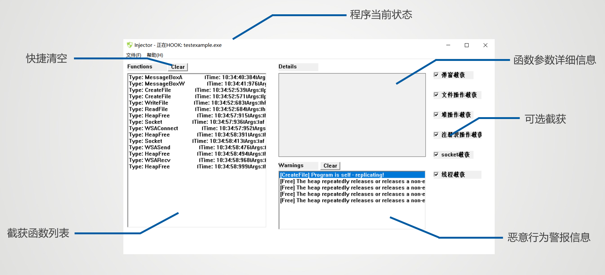

# 软件安全课程设计 - API HOOK

## 项目说明
对于无源码情况下分析样本程序的行为，有多种方法。其中，基于API HOOK的方法是本次软件安全课程设计的任务。

APIGuard是我们设计的一款轻量级的、基于Detours库开发的异常行为检测软件。它的前端采用**MFC**开发，后端依赖**Detours**库，完成dll注射以及Win API截获的功能。

其具体功能如下：
- APIGuard能够完成对大部分**弹窗、堆操作、文件操作、注册表操作、socket操作和线程进程**操作完成截获，并将调用的参数告知使用者。
- APIGuard能够选择是否**提示**弹窗、堆操作、文件操作、注册表操作和socket操作的截获。
- APIGuard能够告知用户程序企图创建进程并运行的程序名，并**让用户选择是否运行**。
- APIGuard能够在截获的基础上完成一些**异常行为分析**，如程序自我复制、堆二次释放和创建恶意进程等。
- 一些基本的软件信息，包括版权所有（~~也许没用~~）、联系作者和开源仓库跳转等。

## 环境搭建
APIGuard搭建使用/开发：

一些基本的操作流程如下：
- 下载安装Visual Studio 2022；
- 下载Detours 4.0.1源码，并完成编译；
- 打开 Dll1/Dll1.sln和注射器/injector/injector.sln，选择“*项目*”-“*属性*”-“*VC++目录*”，修改*包含目录*和*库目录*为你的Detours 4.0.1编译结果路径。
- **在 ***注射器/injector/injector.sln*** 中修改Dll的路径**
- 参与开发，丰富功能。

## 使用说明
### 目录结构
```
# 目录结构
├───asset					# 图片等资源文件
├───OurWork					# 最终成果
	├─app					# 测试app
	├─Dll1					# 注入的DLL
	└─注射器				# APIGuard，实现注入，显示截获
```
### 使用方法
我们***强烈建议***在**使用时关闭搜狗拼音**，它会造成程序截获到未知原因的“HeapFree”等行为。

- 选择“*文件*” - “*打开*”运行可疑程序并开始截获。（如果你暂时不知道该运行什么，我们在OurWork/app/app中给出了一个测试程序）
- 程序会在*Functions框*中输出截获到的函数
- 单击*Functions框*，程序会在*Details框*中显示调用参数、调用时间等详细信息
- 当截获到一些潜在的危险行为，程序会在*Warnings框*中输出提示信息
- 选择“*帮助(H)*”查看版权信息、联系我们。

### UI介绍


### 相关介绍
#### 注射器
程序主体是一段switch case组成的消息处理部分。根据收到的消息类型，执行相应的操作，比如处理按钮点击、定时器触发、绘制窗口等。
功能主体是injectThread函数，用于注入DLL，实现对各种API的挂钩操作。

#### DLL
用于劫持对应API函数，劫持成功以后使用SendMessage将信息发送到UI界面输出。
DetourAttach函数用于挂钩，DetourDetach函数用于脱钩。